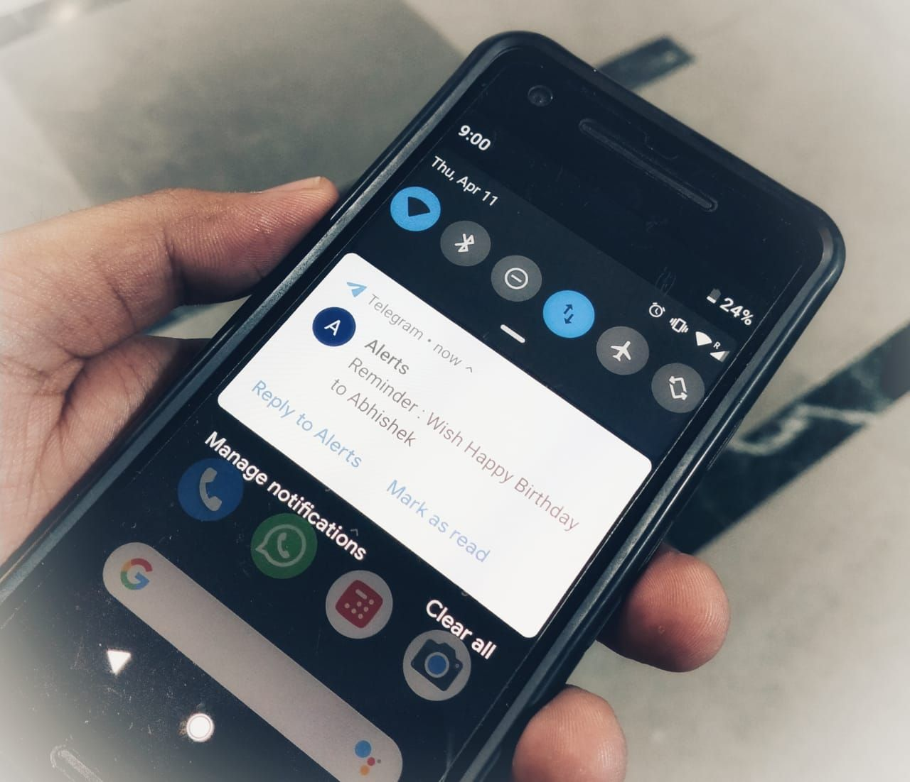
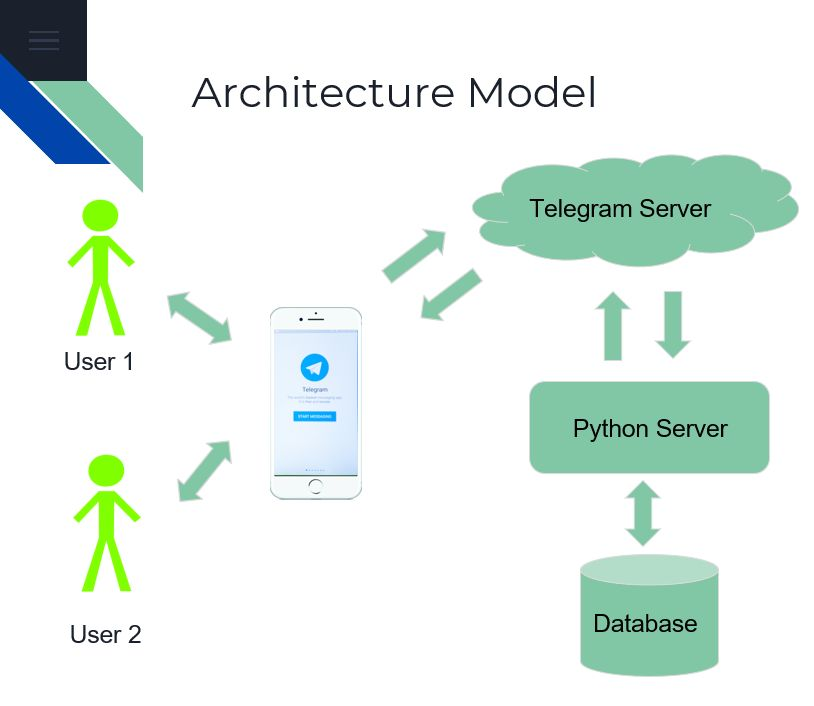
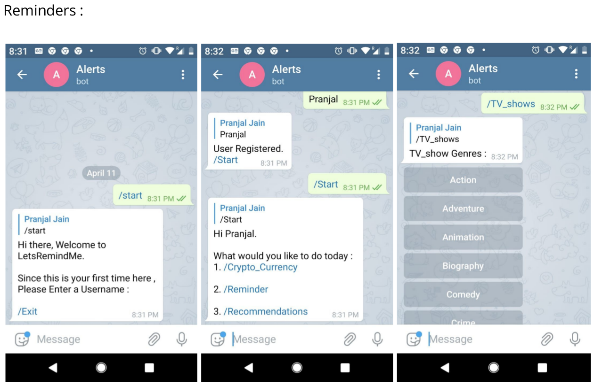
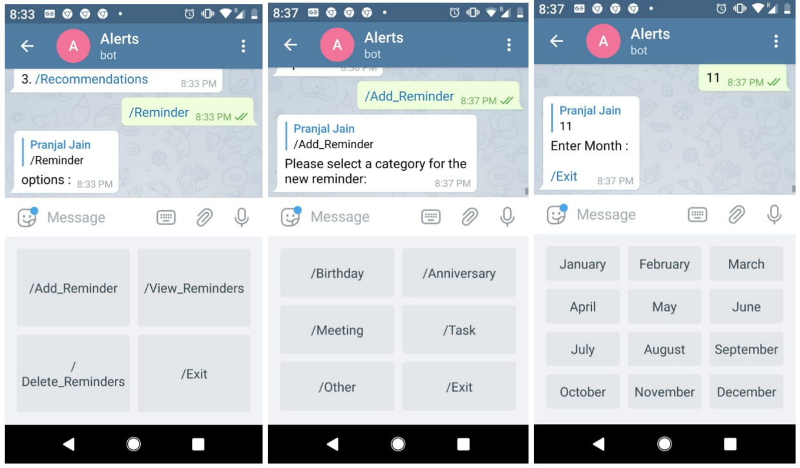
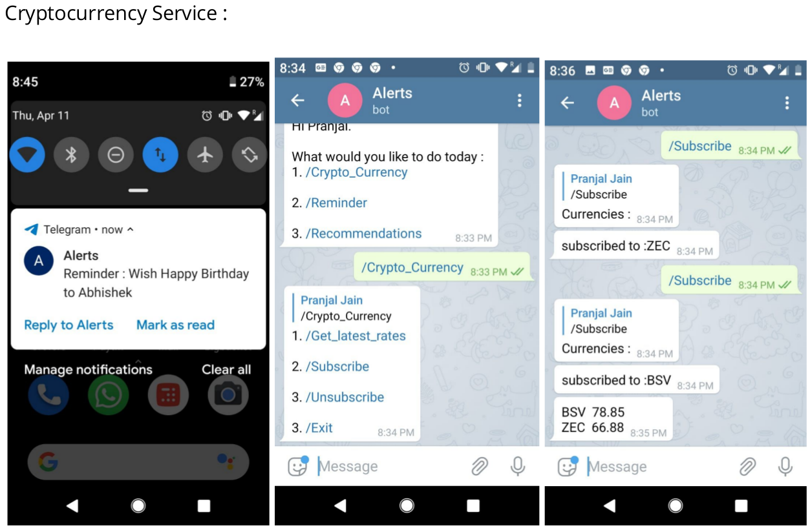
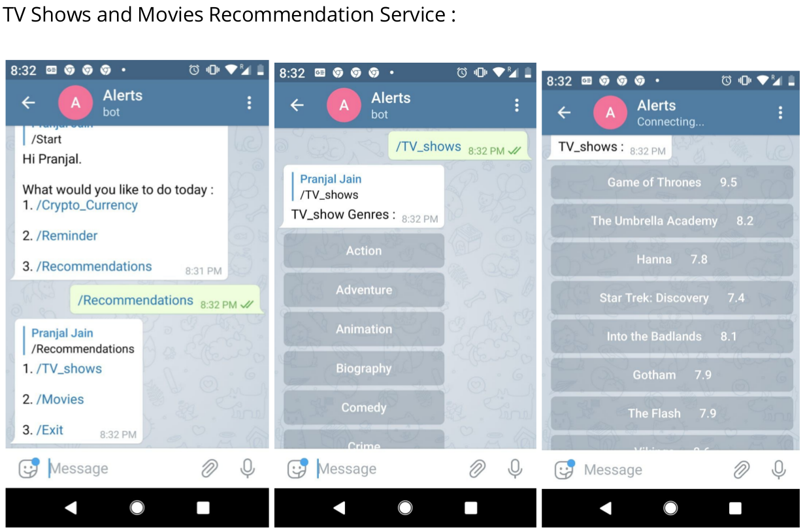

# Telegram Reminder Service with Movie-TV Recommendation System

## Introduction 
In this current age and time People usually forget the birthdays , anniversary , meetings , tasks to perform on time , as they are too busy in their day to day life. This project is developed for those people to get reminder about the important events that they need to give their attention to. Reminder Service is built upon Telegram App which anybody can use at any time. Apart from just a simple reminder service , the app is also aimed to give latest updates to users about some services they subscribed to. 
 
## Project objective 
* Build a simplified reminder service on android platform. 
* New technique to add reminder via chat. 
* Provide extra services that user can subscribe to get updates 
 
## Target Audience  
* Anybody who wants to get notification about some events 
* Cryptocurrency Investors 
* TV Shows and Movies Buffs 

## Features
* Custom Reminders and messages
* TV and Movie Recommendation System
* Cryptocurrency Values Subscription Integrated

## Architecture Model

---

## **Dependencies**
### Telegram Bot
1. Open Telegram
1. Search for BotFather
1. Create a new Bot
1. Note the **API Token** of the bot.

### MySQL Database
### Python Pip
```
sudo apt install python3-pip
sudo pip3 install --upgrade pip
```
### Python Libraries
```
sudo pip3 install telebot bs4 mysql.connector pyTelegramBotAPI apscheduler
```
---
## **Run Code**
* Clone repository 
```
git clone https://github.com/ft-abhishekgupta/telebot-reminderservice
```
* Create a new database in MySQL
* Import ```reminder.sql``` into the database
* Paste database configuration and API Token in ```database_config.py``` file and save.
* Run ```main.py``` file.
```
python3 main.py
```
* Open a new terminal, run ```reminder.py``` file
```
python3 main.py
```
* Open Telegram and search for your Bot, and send **/start**.
---
## Screenshots




---